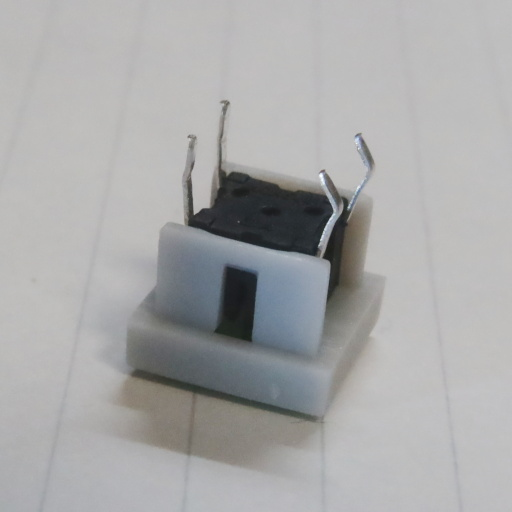
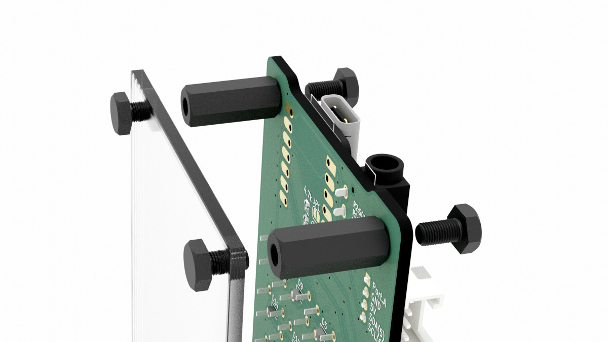
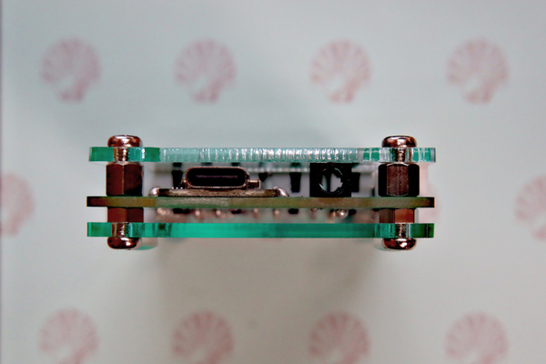

ビルドガイド
============

## PCB 実装

### ステップ 0

ダイオードや抵抗がPCB+SMT製造サービスによって既に実装されている場合は、このステップをスキップしてください。

* 16 x 1N4148 Diodes (D1-D16)
* 2 x 4.7kΩ 0402 Resistor (R1, R2)

これらのダイオードは方向性があります。カソードが左、アノードが右です。

### ステップ 1

* Seeed Xiao RP2040 (U1)

PCB上にSeeed Xiaoボードを置き、Seeed Xiaoの端面スルーホールととPCB上の対応するパッドが以下の3D CGのように一致するようにします。


それぞれの端面スルーホールをとパッドをはんだ付けします。

補足：また、プリント基板にはスルーホールが設けられています。これは位置合わせのために使うこともできますし、強度を増すなどの理由があればスルーホールをハンダ付けすることも可能です。

### ステップ 2

* 1 x TRRS ジャック PJ-320A(または MJ-4PP-9) (TRRS)

TRRS拡張用オプション部品です。不要な場合はこのステップをスキップしてください。

TRRSジャックをPCBに挿入してテープで固定します。フットプリントがぴったり合うように作られているので、きちんと押し込んでください。PCBを裏返します。ピンをはんだ付けします。テープを剥がします。

### ステップ 3

* 1 x GroveコネクタL型スルーホール (J1)

Grove拡張用オプション部品です。不要な場合はこのステップをスキップしてください。

GroveコネクタをPCBに挿入してテープで固定します。PCBを裏返します。ピンをはんだ付けします。テープを剥がします。

### ステップ 4

* 16 x Switronic TS-AGGNH-G プッシュボタン (SW1-16)

プッシュボタンをPCBに挿入してテープで固定します。

スルーホールにうまく入らない場合は、プッシュボタンの足をペンチなどでまっすぐにして入りやすくしてください。
下図の左がペンチでまっすぐにした後の足です。



PCBを裏返します。ピンをはんだ付けします。テープを剥がします。

## ケース

### 最も安価なケースセットアップ〜市販品の利用〜

下図のようにして、アクリルパネルをスペーサーとプラネジで固定します。



### サンドイッチマウントケース

PCB背面に出ているプッシュボタン Switronic TS-AGGNH-G プッシュボタン (SW1-16) および GroveコネクタL型スルーホール (J1) の足が 2mm 以上出ている場合はニッパーなどで切りそろえます。

なべ小ねじ M3 x 8mm → ボトムプレート → 六角ナット M3 x 2.4mm → PCB → 六角スペーサ → トッププレート → なべ小ねじ M3 x 4mm の順番に重ねます。
両端のねじをドライバーなどでしっかりと締めて固定します。



TRRSジャックを付けている場合にはTRRSジャックもトッププレートが支える実装となります。

## ファームウェア

サンプルファームウエアは Platform IO (Arduino) と QMK を用意しています。

### Platform IO/Arduino

サンプルファームウェアの Platform IO プロジェクトは [/firmware/platformio_arduino](../firmware/platformio_arduino) にあります。

必要に応じてプログラムを追加・編集してください。
[サンプルファームウエアのコード](../firmware/platformio_arduino/src/main.c) はシンプルなテンキーで、
さらにGroveコネクタに[M5stack CardKB Unit](https://docs.m5stack.com/en/unit/cardkb_1.1)をつないだときCardKB Unitの入力をキーボード入力に変換する処理が含まれます。

以下に Windows + Visual Studio Code 環境でのファームウェアのビルド・アップロードの方法を記載します。

1. <https://zadig.akeo.ie/> から Zadig をダウンロードします
2. Zadig を起動します
3. PC の USB に Xiaolu KBD をつなぎます
4. Seeed Xiao RP2040 の BOOTボタンを押した状態でリセットボタンを押します。すると、USBマスストレージモード(RPI-RP2)でつながります
5. すると Zadig のウィンドウで RP2 Boot (Interface X) が選択されます。選択されない場合はセレクトボックスから選択します
6. インストール先のドライバとして WinUSB を選択して、 Install Driver ボタンをクリックします
7. しばらくすると The driver was installed successfuly というダイアログが表示されドライバがインストールされます。これで Zadig のウィンドウを閉じます
8. <https://code.visualstudio.com/> から Visual Studio Code をダウンロード・インストールします
9. Visual Studio Code を起動して [PlatformIO IDE](https://marketplace.visualstudio.com/items?itemName=platformio.platformio-ide) 拡張をインストールします。（ VS Code Quick Open (Ctrl+P) で表示されるテキストボックスに `ext install platformio.platformio-ide` を入力して Enter でインストール出来ます ）
10. PlatformIO IDE has been installed successfully installed! Please reload windows と表示されるので Reload Now と書かれたボタンをクリックします
11. <https://github.com/cat-in-136/xiaolu_kbd> を Git で適当なフォルダにクローンするか、 <https://codeload.github.com/cat-in-136/xiaolu_kbd/zip/refs/heads/main> からダウンロードして適当なフォルダに展開します
12. Visual Studio Code の Platformio をクリックして、Pick a folder をクリックし、前項で展開したフォルダの中の [firmware\\platformio_arduino](../firmware/platformio_arduino) 相当のフォルダを選択します
13. "Do you trust the authors of the files in this folder?" というダイアログが出たら "Yes, I trust the authors" と書かれたボタンをクリックします
14. すると依存ライブラリのダウンロードなど (PlatformIO: Configuring project) がされますのでしばらく待ちます
    * **注意:** 手順14でファイルパスが長くなってしまう場合は、以下の手順で対応してください
       1. レジストリエディタを開きます
       2. `コンピューター\HKEY_LOCAL_MACHINE\SYSTEM\CurrentControlSet\Control\FileSystem` に移動します
       3. `LongPathsEnabled` というDWORDの値があることを確認します。ない場合は作成します
       4. `LongPathsEnabled` の値を `1` に設定します
       5. コマンドプロンプトを開き、`git config --system core.longpaths true` と入力して実行します
       6. Windows を再起動します
16. Visual Studio Code の下の [PlatformIO Toolbar](https://docs.platformio.org/en/latest/integration/ide/vscode.html#ide-vscode-toolbar) から → Upload をクリックします
    * 手順 15 でファームウェアのアップロードに失敗するときは、USB がきちんとささっていない他に、 WinUSB がインストールされていない場合があります。

### QMK

[/firmware/qmk/keyboards/cat_in_136/xiaolu_kbd](../firmware/qmk/keyboards/cat_in_136/xiaolu_kbd) を `keyboards/cat_in_136/xiaolu_kbd` にコピーして QMK をビルド・アップロードします。

必要に応じてキーマップを追加・編集してください。
デフォルトキーマップはシンプルなテンキーになっています。

以下に Windows + QMK MSYS 環境でのファームウェアのビルド・アップロードの方法を記載します。

1. <https://msys.qmk.fm/> から QMK MSYS をダウンロード・インストールします
2. QMK MSYS を起動します。
3. コンソール画面で下記を実行します。
   ```console
   $ qmk setup
   ```
4. <https://github.com/cat-in-136/xiaolu_kbd> を Git で適当なフォルダにクローンするか、 <https://codeload.github.com/cat-in-136/xiaolu_kbd/zip/refs/heads/main> からダウンロードして適当なフォルダに展開します
5. 前項で展開したフォルダから `firmware/qmk` を `qmk_firmware/keyboards/cat_in_136/xiaolu_kbd` にコピーします。
   ```console
   $ mkdir qmk_firmware/keyboards/cat_in_136
   $ cp -r path/to/xiaolu_kbd/firmware/qmk/keyboards/cat_in_136/xiaolu_kbd qmk_firmware/keyboards/cat_in_136/xiaolu_kbd
   ```
6. qmk をコンパイルします。
   ```console
   $ qmk compile -kb cat_in_136/xiaolu_kbd -km default
   $ qmk flash -kb cat_in_136/xiaolu_kbd -km default
   ```
7. qmk をアップロードします。
   ```console
   $ qmk flash -kb cat_in_136/xiaolu_kbd -km default
   ```
8. 途中で Waiting for drive to deploy... と表示されるので、Seeed Xiao RP2040 の BOOTボタンを押した状態でリセットボタンを押します。するとファームウエアの書き込みが完了します。
9. Xiaolu KBD がキーボードとして認識されるまでしばらく待ちます。
